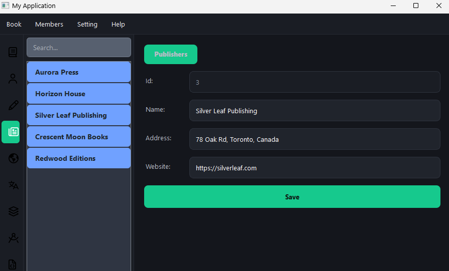
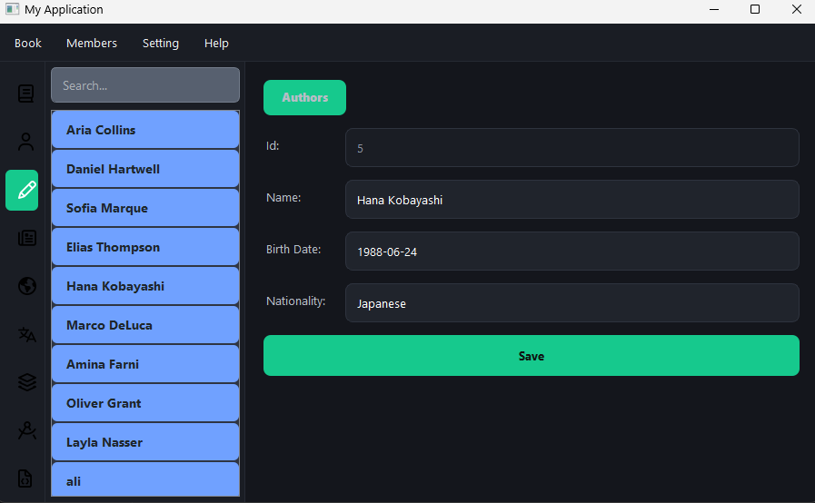

# 📚 BookNest

BookNest is a small desktop app for keeping track of a book collection. It's built with Python and PyQt5, backed by a local SQLite database, and organized around the people and things a library actually cares about: books, authors, publishers, translators, cover designers, categories, languages, and other resources.

Pick a category from the icon rail on the left, search or scroll through the list, and click on any entry to see its full details on the right.

## Screenshots

Browsing the publisher catalog 


Viewing an author's details 


## Getting started

### Requirements
- Python 3.10+
- PyQt5

### Installation

```bash
# 1. Clone or download the project, then move into it
cd BookNest

# 2. (recommended) create a virtual environment
python -m venv .venv
source .venv/bin/activate      # on Windows: .venv\Scripts\activate

# 3. install the only dependency
pip install PyQt5
```

### Running the app

```bash
python run.py
```

That's it — the app opens with the existing sample library data already loaded from `data/NewLibrary.db`.

## Project layout

```
BookNest/
├── run.py                 # entry point — start here
├── layout/                 # main window, navigation, and global styling
├── component/               # one folder per entity (author, book, publisher, ...)
│   └── common/              # shared list panel + detail form widgets
├── adapters/                # SQLite data-access layer
├── models/                  # plain data classes (Author, Book, Publisher, ...)
└── data/                    # SQLite database and its schema/seed script
```

## License

MIT — see [LICENSE](LICENSE).